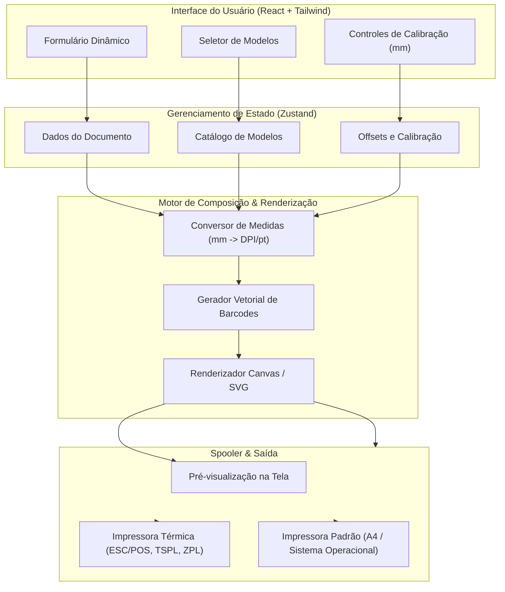

<div align="center">
  

  # Folium Print

  *Criação, visualização e impressão ágil de etiquetas e documentos com calibração milimétrica*

  [](LICENSE)
  [](#)
  [](#)
  [](#)
  [](#)

  [Recursos](#recursos) • [Arquitetura](#arquitetura) • [Instalação](#instalação) • [Uso](#uso) • [Calibração](#calibração-e-impressão) • [Desenvolvimento](#desenvolvimento)

</div>

---

**Folium Print** é uma aplicação desktop ágil e intuitiva projetada para criação, visualização e impressão rápida de etiquetas e documentos a partir de modelos predefinidos.

Preencha os dados em formulários dinâmicos, confira a pré-visualização em tempo real (WYSIWYG) e envie diretamente para folhas A4 padronizadas ou bobinas térmicas com calibração milimétrica de margens e suporte nativo a códigos de barras e QR Codes.

> [!NOTE]
> O Folium Print opera de forma 100% offline. Todos os cálculos de layout, conversões milimétricas e renderização de códigos de barras são executados localmente, garantindo máxima privacidade e resposta instantânea em ambientes operacionais e de varejo.

## Recursos

- **Pré-visualização WYSIWYG em tempo real**: Atualização visual instantânea conforme os campos do formulário são preenchidos.
- **Calibração milimétrica de precisão**: Ajuste fino de sangria, espaçamentos e compensação de deslocamento ($x, y$) para tração mecânica.
- **Simbologia de código de barras e QR Code nativa**: Geração offline e vetorial de EAN-13, EAN-8, Code 128, Code 39, QR Code e Data Matrix sem requisições externas.
- **Suporte híbrido de mídia**:
  - Folhas A4 com matrizes customizáveis (ex.: gabaritos Pimaco, Avery).
  - Rolos contínuos e etiquetas destacáveis em impressoras térmicas (Zebra, Elgin, Argox, Xprinter).
- **Entrada dinâmica de dados**: Formulários reativos que se adaptam conforme o modelo de documento selecionado.
- **Arquitetura modular e leve**: Desenvolvido com foco em baixo consumo de memória e inicialização imediata.

## Arquitetura

O projeto divide responsabilidades entre a camada de interface reativa, o motor matemático de coordenadas e o subsistema de despacho de impressão:



### Princípios de Design

1. **Coordenadas baseadas em milímetros**: Todas as dimensões de templates e margens são definidas em `mm`. O motor calcula a conversão para pontos ou pixels com base na resolução de saída do dispositivo (203, 300 ou 600 DPI).
2. **Independência de driver**: A composição do documento não depende de drivers proprietários. O spooler traduz o canvas gerado para o subsistema nativo do sistema operacional ou fluxos de comando diretos.
3. **Persistência de ajustes**: Calibrações de offset mecânico e preferências de impressora permanecem armazenadas localmente no perfil do operador.

## Instalação

### Pré-requisitos

- [Node.js](https://nodejs.org/) versão 18 LTS ou superior
- Gerenciador de pacotes (`npm`, `pnpm` ou `yarn`)

### Passo a Passo

1. Clone o repositório:
   ```bash
   git clone https://github.com/Bakurin0/Folium-Print.git
   cd Folium-Print
   ```

2. Instale as dependências:
   ```bash
   npm install
   ```

## Uso

### Ambiente de Desenvolvimento

Inicie o servidor de desenvolvimento com recarregamento em tempo real:

```bash
npm run dev
```

A interface estará acessível localmente e o painel desktop será iniciado automaticamente.

### Compilação e Empacotamento

Gere os arquivos executáveis otimizados para distribuição na sua plataforma:

```bash
npm run build
```

Os binários de instalação serão gerados no diretório `dist/`.

## Calibração e Impressão

Ao trabalhar com impressoras térmicas ou folhas de etiquetas pré-cortadas, pequenas variações mecânicas podem deslocar a impressão.

> [!TIP]
> Caso a impressão saia ligeiramente deslocada do corte do papel adesivo, utilize a ferramenta de **Offset Milimétrico** no painel de configurações para aplicar correções nos eixos $X$ e $Y$ em frações de milímetro.

| Cenário | Resolução Típica | Recomendação |
| :--- | :--- | :--- |
| **Etiquetas Térmicas (Bobina)** | 203 DPI ou 300 DPI | Defina o espaçamento entre etiquetas (gap) e calibre o offset vertical. |
| **Folhas A4 (Matriz Pimaco/Avery)** | 300 DPI ou 600 DPI | Configure a margem de segurança da impressora para evitar corte nas bordas da página. |

> [!IMPORTANT]
> Certifique-se de que a escala de impressão nas propriedades do sistema esteja definida em **100% (Tamanho Real)** e nunca em "Ajustar à página", para não descalibrar as medidas físicas calculadas pelo aplicativo.

## Desenvolvimento

### Estrutura do Repositório

```text
Folium-Print/
├── src/
│   ├── assets/              # Ícones e fontes tipográficas
│   ├── components/          # Componentes de UI, preview e formulários
│   ├── core/                # Motores de calibração, cálculo e simbologias de barcode
│   ├── templates/           # Modelos de etiquetas e esquemas de validação
│   ├── store/               # Estados globais da aplicação
│   ├── hooks/               # Custom hooks utilitários
│   └── App.tsx              # Componente base da aplicação
├── tests/                   # Testes unitários para cálculos de DPI e templates
├── Blue Folder.ico          # Ícone da aplicação
└── README.md                # Documentação técnica
```

### Qualidade de Código e Testes

Para executar as suítes de validação de tipagem e testes unitários:

```bash
# Análise estática e validação de tipos
npm run lint
npm run typecheck

# Execução de testes unitários
npm run test
```
