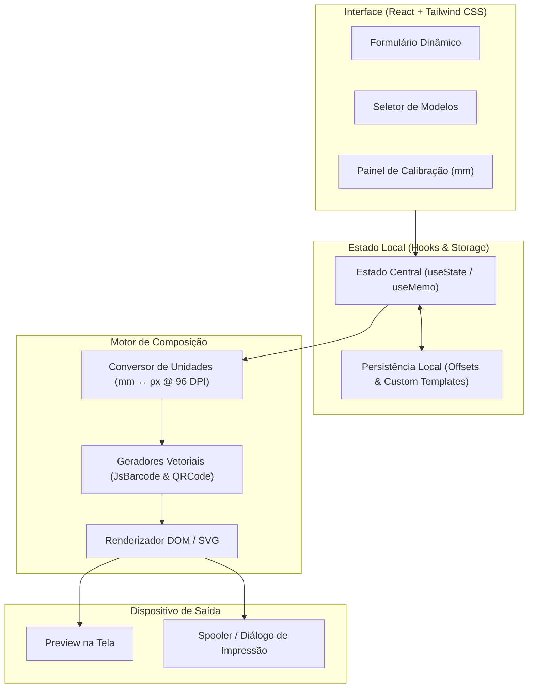

<div align="center">
  

  # Folium Print

  *Composição vetorial e impressão física com calibração milimétrica de etiquetas e folhas A4*

  [](LICENSE)
  [](#)
  [](#)
  [](#)
  [](#)

  [Recursos](#recursos) • [Arquitetura](#arquitetura) • [Instalação](#instalação-e-execução) • [Calibração](#calibração-mecânica)

</div>

---

**Folium Print** é uma ferramenta desktop para diagramação e impressão de etiquetas térmicas e folhas matriciais A4 com controle milimétrico de coordenadas ($x, y$), margens e sangria.

Todo o cálculo de layout, vetores SVG e geração de códigos de barras (Code 128, EAN-13, QR Code) roda localmente no cliente, sem requisições externas ou dependência de serviços em nuvem.

## Recursos

- **Pré-visualização WYSIWYG em escala real**: Renderização dinâmica sincronizada com os campos do formulário.
- **Calibração de tração mecânica**: Ajuste milimétrico de offset nos eixos $X$ e $Y$ para compensar desvios de alimentação física do papel.
- **Simbologia de código de barras e QR Code local**: Geração vetorial offline de Code 128, EAN-13, EAN-8, Code 39 e QR Code via canvas/SVG.
- **Suporte a mídias industriais e de escritório**:
  - Folhas A4 matriciais com seleção de posição inicial para aproveitamento de etiquetas restantes.
  - Bobinas térmicas contínuas ou destacáveis com controle de corte.
- **Editor visual integrado**: Criação e customização de modelos com caixas arrastáveis e suporte a vetores SVG de logotipo.
- **Acessibilidade e física tátil**: Conformidade com WCAG 2.2 AA (foco visível, navegação por teclado e semântica ARIA) e física de interface inspirada na filosofia de Emil Kowalski.

## Arquitetura

O sistema organiza o fluxo entre entrada de dados, motor milimétrico e despacho de impressão:



## Instalação e Execução

### Pré-requisitos

- [Node.js](https://nodejs.org/) versão 18 LTS ou superior
- Gerenciador [pnpm](https://pnpm.io/) (recomendado) ou npm

### Desenvolvimento

```bash
# 1. Instalar dependências
pnpm install

# 2. Iniciar servidor Vite local
pnpm dev

# 3. Executar com ambiente de desktop Tauri (opcional)
pnpm tauri dev
```

### Compilação

Para validar tipagem TypeScript e gerar os assets de produção:

```bash
pnpm build
```

## Calibração Mecânica

Em impressoras térmicas ou folhas adesivas pré-cortadas, tolerâncias mecânicas da tração do rolo podem deslocar o início da impressão.

1. **Ajuste de Escala:** No diálogo de impressão do sistema operacional, mantenha a escala em **100% (Tamanho Real)**. Desative opções automáticas como "Ajustar à página" ou "Encolher para caber".
2. **Offset Fino:** Utilize a aba **Calibração** no painel lateral para somar ou subtrair frações de milímetro nos eixos horizontal e vertical até alinhar o conteúdo exatamente à faca do papel adesivo.
